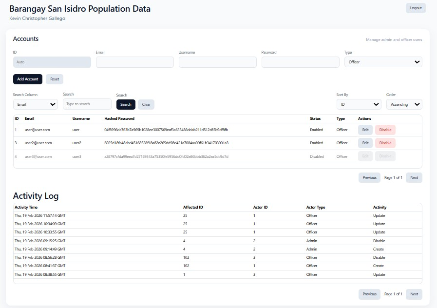
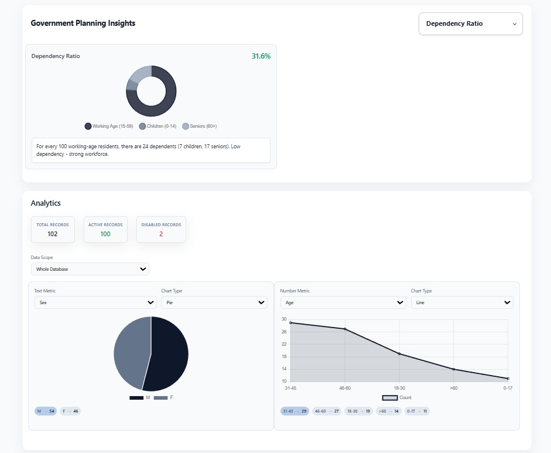
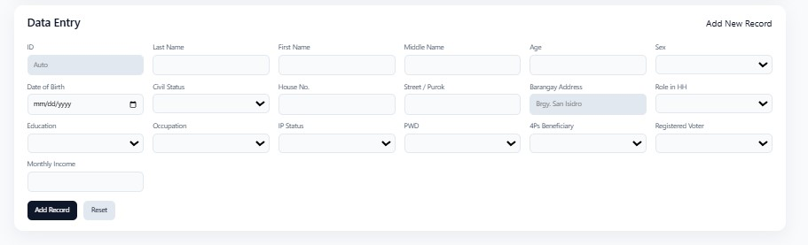
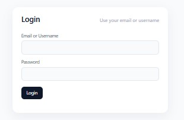
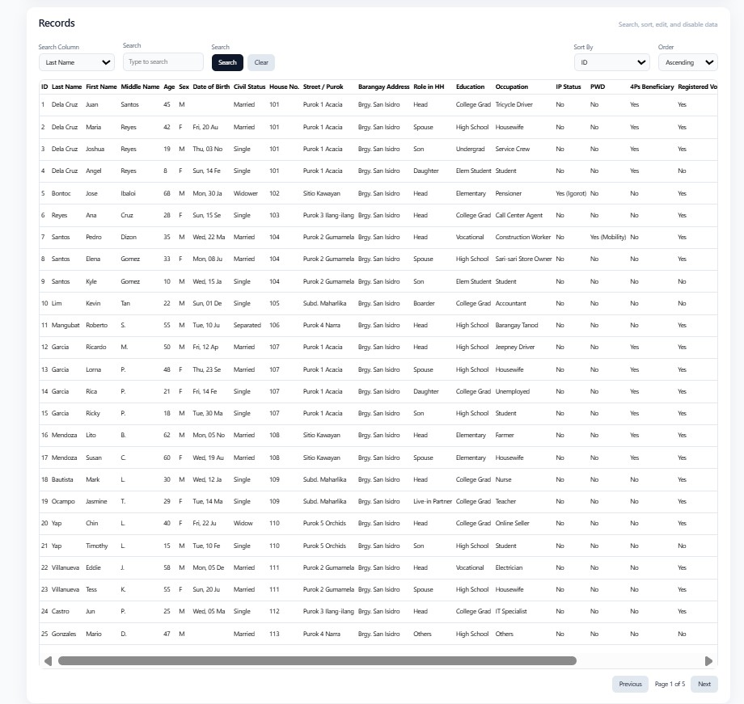

README.md
# Government Planning Insights Dashboard

This project is a web-based analytics dashboard designed to provide insights into various government planning metrics. It features interactive charts, data management capabilities, and a responsive user interface to help users visualize and understand key data points related to dependency ratios, vulnerability, education-income mismatch, household density, and voter registration gaps.

## Features

### Data Management & Display
*   **Record Management:** Load, display, and manage various records within the application.
*   **Pagination:** Efficiently browse through large datasets with built-in pagination controls.
*   **Sorting:** Sort records by different columns to organize data as needed.
*   **Filtering & Searching:** Powerful search and filter functionalities to quickly find specific data.
*   **Global Statistics:** View overall statistics, such as total and disabled records.

### Analytics & Data Visualization
*   **Government Planning Insights:** A dedicated section for in-depth analysis of government-related data.
*   **Interactive Charts:** Utilizes Chart.js to render dynamic and interactive visualizations for:
    *   Dependency Ratio
    *   Vulnerability Overlap
    *   Education-Income Mismatch
    *   Household Density
    *   Voter Registration Gap
*   **Dynamic Chart Selection:** A user-friendly dropdown allows users to select and view one government planning chart at a time, optimizing screen space and focus.
*   **Number Metric Charts:** Additional charts for visualizing various numerical metrics.

### User Interface & Experience
*   **Responsive Design:** The dashboard is designed to be fully responsive, providing an optimal viewing experience across various devices, from desktops to mobile phones.
*   **Themed Styling:** A clean and modern aesthetic with custom CSS, card-based layouts, and distinct styling for insights and charts.
*   **Interactive Elements:** Intuitive controls for searching, clearing filters, pagination, and chart selection.

### Technical Architecture
*   **Frontend:** Built with HTML, CSS, and JavaScript, leveraging Bootstrap for responsive layouts and UI components.
*   **Charting:** Integrates Chart.js for robust and customizable data visualizations.
*   **Backend Interaction:** Implies interaction with a backend API (e.g., `/api/stats`) for data retrieval and potentially other operations.
*   **User Roles:** Supports different user types (e.g., "Admin") with potentially varying access levels and functionalities.

## Technologies Used

*   **HTML5:** For structuring the web content.
*   **CSS3:** For styling and layout, including custom themes and responsive design.
*   **JavaScript (ES6+):** For interactive functionalities, data manipulation, and DOM management.
*   **Bootstrap 5:** A popular CSS framework for responsive and mobile-first front-end web development.
*   **Chart.js:** A flexible JavaScript charting library for creating various types of data visualizations.
*   **Git:** Version control system.

## Screenshots

Here are some screenshots illustrating the various sections and functionalities of the dashboard:

### Login Page


### Accounts Management


### Records Management


### Data Entry


### Government Planning Insights & Analytics


## Setup and Installation

To get a local copy up and running, follow these simple steps.

### Prerequisites

*   A web browser (e.g., Chrome, Firefox, Edge)
*   (Optional) A local web server to serve the HTML file, if you're running into CORS issues with local file access.

### Installation

1.  **Clone the repository:**
    ```bash
    git clone https://github.com/your-username/Aptitude_Test_Output.git
    cd Aptitude_Test_Output
    ```
    *(Replace `your-username` with your actual GitHub username and `Aptitude_Test_Output` with your repository name if it's different.)*

2.  **Open `index.html`:**
    Simply open the `index.html` file in your preferred web browser.
    ```bash
    start index.html # On Windows
    open index.html  # On macOS
    xdg-open index.html # On Linux
    ```
    Alternatively, if you have a local server set up (e.g., using `http-server` or a Python simple server), navigate to the project directory and start the server:
    ```bash
    # Example using Python's http.server
    python -m http.server 8000
    ```
    Then, open your browser and go to `http://localhost:8000`.

## Usage

*   **Navigate the Dashboard:** Explore the different sections of the dashboard.
*   **Filter and Sort:** Use the search bar, column filters, and sorting options to refine the displayed data.
*   **View Charts:** Select different government planning charts from the dropdown menu to visualize specific metrics.
*   **Interact with Charts:** Hover over chart elements for more details.

## Contributing

Contributions are what make the open-source community such an amazing place to learn, inspire, and create. Any contributions you make are **greatly appreciated**.

1.  Fork the Project
2.  Create your Feature Branch (`git checkout -b feature/AmazingFeature`)
3.  Commit your Changes (`git commit -m 'Add some AmazingFeature'`)
4.  Push to the Branch (`git push origin feature/AmazingFeature`)
5.  Open a Pull Request

## License

Distributed under the MIT License. See `LICENSE` for more information.
